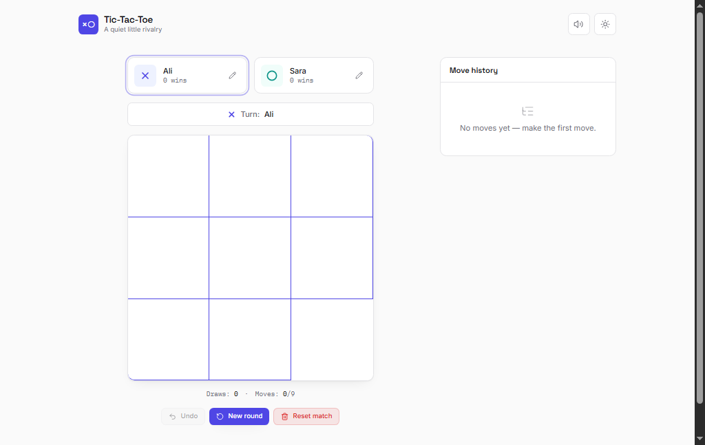
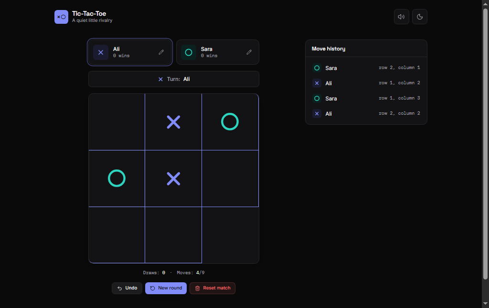
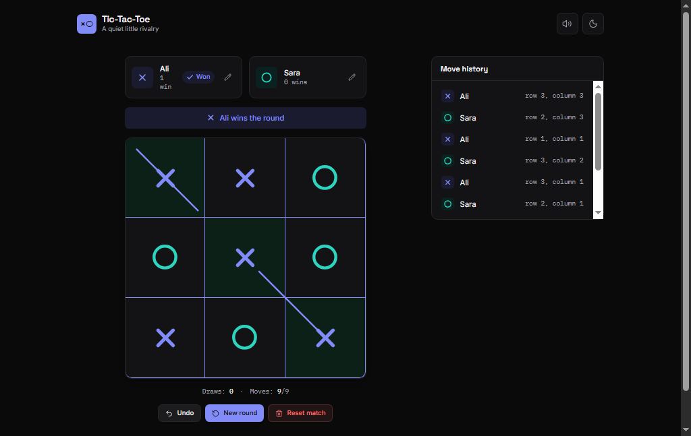

# Tic-Tac-Toe

A premium, accessible Tic-Tac-Toe built with React, Vite, and Tailwind CSS. Two players, one board, a scoreboard that remembers, and a theme system you can restyle by editing a handful of variables.

## Features

- **Classic 2-player local play** — X and O alternate on a 3×3 board, with instant win/draw detection.
- **Editable player names** — click the pencil icon on either player card; names sync everywhere (board, scoreboard, move history) and persist between sessions.
- **Scoreboard** — wins per player and draws, saved to `localStorage` so they survive a refresh.
- **Move history** — a live, scrollable log of every move with player, symbol, and board position.
- **Undo** — step back one move at a time, even after a round has ended.
- **New round / Reset match** — start a fresh round without losing the score, or wipe everything back to zero.
- **Animated winning line** — the win is marked with a hand-drawn-style strike through the three winning cells, not just a color change.
- **Light / dark / system theme** — cycles through all three, applied instantly with no flash-of-wrong-theme on load.
- **Sound effects** — short synthesized tones for moves, wins, draws, and undo (Web Audio API, no audio files to load), with a one-click mute.
- **Keyboard support** — every square is a focusable, operable button; arrow keys move focus around the grid.
- **Fully responsive** — comfortable from a small phone up to a wide desktop layout.

## Screenshots

| Empty board (light) | Mid-game (dark) | Winning line |
| --- | --- | --- |
|  |  |  |

## Tech stack

| Layer      | Choice                                          |
| ---------- | ------------------------------------------------ |
| Framework  | [React 19](https://react.dev)                    |
| Build tool | [Vite](https://vite.dev)                          |
| Styling    | [Tailwind CSS v4](https://tailwindcss.com) (via `@tailwindcss/vite`, no separate PostCSS config needed) |
| Icons      | [lucide-react](https://lucide.dev)                |
| Linting    | ESLint 10, `eslint-plugin-react-hooks`, `eslint-plugin-react-refresh` |
| Persistence | Browser `localStorage` (theme, sound, player names, scores, in-progress moves) |
| Audio      | Native Web Audio API (no audio assets)            |

No backend, no database, no build-time API keys — it's a static site that can be hosted anywhere that serves static files.

## Folder structure

```
tic-tac-toe/
├─ index.html                 Vite entry HTML (includes the anti-flash theme script)
├─ public/
│  └─ favicon.svg
├─ src/
│  ├─ main.jsx                React root
│  ├─ App.jsx                 Composes layout + hooks into the full page
│  ├─ index.css               Tailwind import, design tokens, animations
│  ├─ hooks/
│  │  ├─ useTicTacToe.js       Core game state (single source of truth: the move list)
│  │  ├─ useTheme.js           Light / dark / system theme, persisted
│  │  ├─ useSound.js           Synthesized sound effects, persisted mute state
│  │  └─ useLocalStorage.js    Generic localStorage-backed state helper
│  ├─ lib/
│  │  ├─ gameLogic.js          Pure functions: board building, win detection, labels
│  │  └─ utils.js              Small className-joining helper
│  └─ components/
│     ├─ layout/Header.jsx     Wordmark + sound/theme toggles
│     ├─ ui/Button.jsx         Button variants (primary/secondary/ghost/destructive)
│     ├─ ui/IconButton.jsx     Square icon button used for toggles
│     ├─ ThemeToggle.jsx       Theme-cycling icon button
│     └─ game/
│        ├─ Board.jsx          3×3 grid, keyboard navigation, winning-line overlay
│        ├─ Square.jsx         A single cell
│        ├─ WinningLine.jsx    Animated SVG strike-through line
│        ├─ StatusBar.jsx      "X's turn" / "Player wins" / "It's a draw" banner
│        ├─ PlayerCard.jsx     Editable name, symbol, score, active-turn ring
│        ├─ Controls.jsx       Undo / New round / Reset match
│        └─ MoveHistory.jsx    Scrollable move log with an empty state
├─ eslint.config.js
├─ vite.config.js
└─ package.json
```

## Installation

Requires **Node.js 20 or later** (Vite 8's minimum) and npm.

```bash
git clone <your-repo-url>
cd tic-tac-toe
npm install
```

## Running locally

```bash
npm run dev
```

Vite prints a local URL (typically `http://localhost:5173`) — open it in your browser. Changes to any file hot-reload instantly.

## Build

```bash
npm run build
```

Outputs an optimized static bundle to `dist/`. Preview the production build locally with:

```bash
npm run preview
```

## Development

```bash
npm run lint
```

Runs ESLint across the project (JS/JSX, React Hooks correctness, React Refresh rules). The project ships with zero lint errors — keep it that way before opening a PR.

## Scripts

| Script            | What it does                                  |
| ----------------- | ---------------------------------------------- |
| `npm run dev`      | Start the Vite dev server with hot reload      |
| `npm run build`    | Production build to `dist/`                    |
| `npm run preview`  | Serve the production build locally             |
| `npm run lint`     | Run ESLint                                     |

## Project architecture

The game is modeled around **one source of truth**: an ordered array of moves (`{ index, symbol, moveNumber }`), owned by the `useTicTacToe` hook. Everything else — the board, whose turn it is, the winner, whether it's a draw, and the move-history list — is *derived* from that array with `useMemo`, rather than tracked as separate, independently-updated state.

This matters because the previous version of this project had a class of bugs that came from state living in more than one place (a player's display name lived only inside the `Player` component and never reached the component that actually decided who won; the board stayed clickable after the game ended because nothing centrally tracked "is this game over"). Deriving everything from one array makes those states impossible to get out of sync, and makes undo a one-line operation (`moves.slice(0, -1)`) instead of a separate, error-prone code path.

Component responsibilities:

- **`hooks/useTicTacToe.js`** — the only place game rules live: whose turn it is, win/draw detection, scoring, undo, restart, player names.
- **`hooks/useTheme.js`** / **`hooks/useSound.js`** — self-contained concerns (theme, audio) that `App.jsx` wires into the header and into game events (`onMove`, `onWin`, `onDraw`, `onUndo`).
- **`lib/gameLogic.js`** — pure, framework-agnostic functions with no React dependency, so the rules are easy to unit test in isolation if you add a test runner later.
- **`components/game/*`** — presentational components that receive derived state as props and call back up through the small set of actions the hook exposes (`playMove`, `undoLastMove`, `restartRound`, `resetMatch`, `updatePlayerName`).

## Theme customisation

All colors are CSS custom properties defined once in `src/index.css`, then mapped onto Tailwind's theme with a single `@theme inline` block. **You never need to touch a component file to restyle the app.**

To change the palette, edit the variables in `:root` (light theme) and `.dark` (dark theme overrides) at the top of `src/index.css`:

```css
:root {
  --background: #fafafa;
  --foreground: #18181b;
  --primary: #4f46e5;
  --x: #4f46e5;        /* X symbol color */
  --o: #0d9488;        /* O symbol color */
  --success: #16a34a;  /* winning-line color context */
  /* …and so on */
}
```

Every one of these becomes an ordinary Tailwind utility — `bg-background`, `text-x`, `border-border`, `ring-ring`, `bg-x-soft`, etc. — so once you've changed the variable, every component that uses that utility updates automatically.

Fonts work the same way: `--font-display`, `--font-sans`, and `--font-mono` are set once in the `@theme inline` block and used via `font-display` / `font-sans` / `font-mono` utility classes.

## Future improvements

Ideas that were deliberately left out to keep this a focused, dependency-light showcase, but would be reasonable next steps:

- Online multiplayer (would need a backend / WebSocket layer)
- A simple AI opponent (minimax) for single-player mode
- Automated tests for `lib/gameLogic.js` (the pure functions are already structured to be easy to unit test)
- An animated confetti burst on a win, behind a "reduced motion" check
- Exporting match history as a shareable link or file

## Accessibility

- Every square is a real `<button>`, so it's reachable and operable via keyboard (Tab, Enter/Space) with no extra work.
- Arrow keys move focus around the 3×3 grid for faster keyboard play, layered on top of — not replacing — normal Tab order.
- All interactive elements have visible focus rings (`focus-visible:ring-2`) that meet contrast requirements in both themes.
- Turn changes and round results are announced via `aria-live="polite"` regions in the status banner.
- Icon-only buttons (theme toggle, sound toggle, edit-name) all carry `aria-label`s.
- Color is never the only signal: the winning line is an actual drawn line (not just a background tint), and the status banner uses icons + text, not color alone.
- Animations are disabled for users with `prefers-reduced-motion: reduce`.
- Text and interactive-element contrast was chosen to comfortably clear WCAG AA in both light and dark themes.

## Performance considerations

- Game state, winner, and draw checks are all `useMemo`-derived from a small array (at most 9 entries) — there's no meaningful computation cost even on low-end devices.
- Tailwind v4's Vite plugin generates only the CSS actually used (no unused utility bloat in the shipped bundle).
- No animation runs on a timer/interval; everything is CSS `@keyframes` driven by class application, so the main thread stays idle between interactions.
- The production bundle has no unnecessary dependencies: `react`, `react-dom`, and `lucide-react` (tree-shaken to only the icons actually imported).

## License

MIT — see [`LICENSE`](LICENSE) for details. Replace or update this section if you intend to publish under different terms.

## Contributing

Contributions are welcome.

1. Fork the repo and create a branch: `git checkout -b feature/your-feature`
2. Make your changes; keep components focused and prefer deriving state over duplicating it (see [Project architecture](#project-architecture))
3. Run `npm run lint` and `npm run build` and confirm both pass cleanly
4. Open a pull request describing what changed and why

Please keep PRs scoped to one concern at a time — it makes review much faster.
